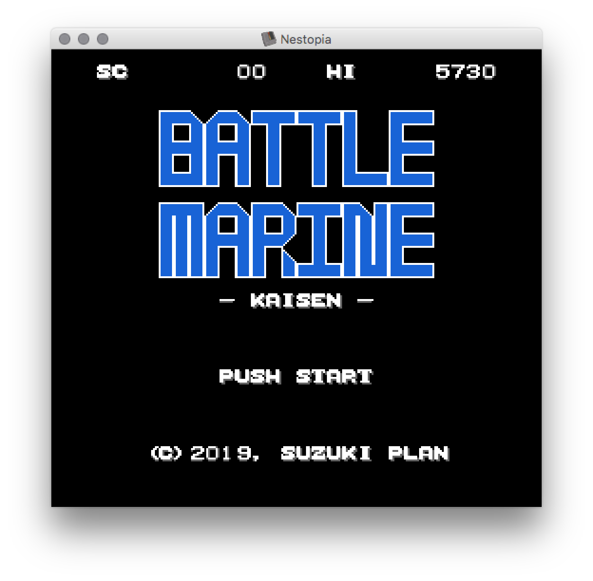
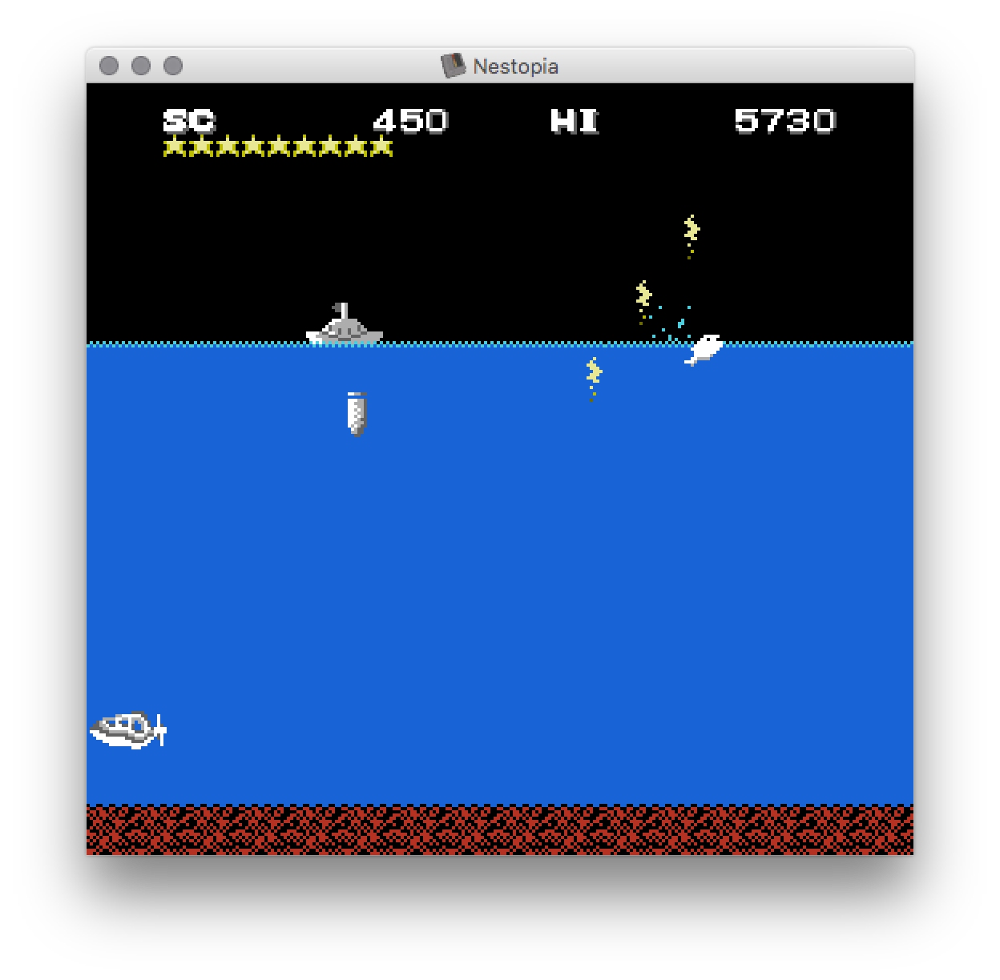

# Battle Marine (ファミコン版)

以前、SUZUKI PLANがスマホ向けアプリとして販売していたBattle Marineをファミコンに移植したものです。ハード制約上、完全移植ではないです。

|タイトル|ゲーム画面|
|---|---|
|||

## How to play

- [bmarine.nes](bmarine.nes)をダウンロードしてエミュレータでプレイしてください
- Mapper0のカートリッジに焼けば恐らく実機でも動く筈です（未確認）
- [RPGアツマール（ブラウザ）](https://game.nicovideo.jp/atsumaru/games/gm9680) でもプレイできます（ただし、スマホ未対応）

### Rules

- カーソルで自機を左右に移動してAボタン or Bボタンでショットを撃てます
- ショットで敵機を破壊してください
- 敵機を破壊すると10点の得点が入り, メダルが1加算されます
- メダルは最大15まで増えますが, ミスショットをすると半減します
- 敵機を破壊した時点での所持メダル数 x 10点のボーナスが入ります
- 敵機にぶつかるとゲームオーバーです

（敵の種類）
- 潜水艦: 固定方向へ一定速度で移動し自機と照準が合うと魚雷を撃ってきます
- サカナ: 固定方向へ一定速度で移動します（※気分がハイな場合はジャンプしてきます）
- カモメ: 固定方向へ一定速度で移動し自機と照準が合うとうんこを落としてくる場合がありますが便秘気味の個体も存在します
- カニ: 固定方向へ一定速度でジャンプ移動し誘導弾を撃ってくる場合があります

(攻略のコツ)
- 無闇にショットを撃つより、確実に狙って撃った方が高得点を狙えます
- うんこ以外の当たり判定は水しぶきが発生する瞬間フレームのみです
- うんこはシビアに毎フレーム当たり判定しているので気をつけましょう
- カニは画面外アウトせずループする仕様なので、見つけたら即破壊しないとキケンです

## How to build

### Pre-requests

以下のツールが必要です。

- GNU make
- [cc65](https://cc65.github.io/)
- [bmp2chr](https://github.com/suzukiplan/bmp2chr)
- ファミコンエミュレータ

### Build command

```
make
```

## License

- 一般向け: [GPLv3](LICENSE.txt)
- カスタムライセンスを希望される場合emailにて個別にご連絡ください
